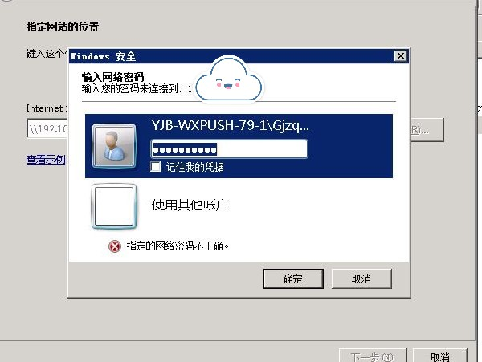

title: Linux 挂载异常处理
tags: 系统
categories: 运维
date: 2020-05-10 11:39:00
---

> 大清早被电话吵醒说服务异常让看一下，眯着眼摸电脑开机联网连堡垒机登录服务器一套流程熟练的都没人心疼。


### 故障定位
根据异常现象定位到出现问题的应用，登录到相应的服务器查看业务日志。  
```bash
[root@middleware-0-2 logs]#  tail -f project.log
2020-05-10 09:00:03,124 ERROR  UpdateRepDbf - 更新应答库线程中断异常
java.lang.NullPointerException: null
2020-05-10 09:00:03,125 ERROR  ReaderRandom - 应答库路径错误:/zdData/rep.dbf,message:
java.io.FileNotFoundException: /zdData/rep.dbf (Permission denied)
	at java.io.......
```
通过业务日志发现是由于共享盘文件(windwos文件夹)不存在导致的业务异常，然后查看挂载情况

<!-- more -->
### 异常处理
首先查看挂载情况  
```bash
[root@middleware-0-2 /]#  cd /
[root@middleware-0-2 /]#  ls -l |grep zd
d??????????   ? ?    ?        ?            ? zdData

[root@middleware-0-2 /]# df -h
Filesystem            Size  Used Avail Use% Mounted on
/dev/mapper/VolGroup-lv_root
                       95G  6.1G   84G   7% /
tmpfs                 3.9G     0  3.9G   0% /dev/shm
/dev/sda1             190M   41M  140M  23% /boot
```
发现挂载已卸载，且挂载文件处于异常状态，查看linux 系统状态   
```bash
[root@ccount-csdc-170-183 /]# uptime
 11:11:17 up 144 days, 23:02, 18 users,  load average: 0.08, 0.18, 0.29
```
linux 系统无异常启动，查看windwos 服务器是否启动  
```bash
[root@middleware-0-2 /]#  ping 192.168.0.1
PING 192.168.0.1 (192.168.0.1) 56(84) bytes of data.
64 bytes from 192.168.0.1: icmp_seq=1 ttl=123 time=0.642 ms
64 bytes from 192.168.0.1: icmp_seq=2 ttl=123 time=0.670 ms
64 bytes from 192.168.0.1: icmp_seq=3 ttl=123 time=0.751 ms
```
业务服务器无异常及windows服务器存活，尝试重新挂载共享盘  
```bash
[root@middleware-0-2 /] umount zdData
[root@middleware-0-2 /]#  mount.cifs //192.168.0.1/data /zdData -o user=user,pass=pass1
mount error(13): Permission denied
Refer to the mount.cifs(8) manual page (e.g. man mount.cifs)
```
挂载失败报错，初步判断共享盘出现问题，尝试通过windows服务器挂载共享盘  


发现为密码错误，联系同事得知密码已修改，通过新密码挂载共享盘重启应用后问题解决


