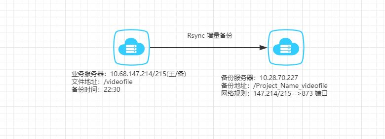

title: Rsync文件同步
tags: OS
categories: Linux
date: 2020-02-16 23:10:00
---
>出于容灾的考虑，每日晚对视频文件进行备份。

### 技术选型
文件传输我最常用的是`rsync`和`scp`，两者都基于ssh协议进行文件传输。 介于申请22端口的网络规则，我会被按在地上打，所以需要使用其它端口进行文件传输。

#### 解决方案
1. ssh监听多个端口，使用`rsync`或`scp`进行文件传输
1. 使用`scp`的`-P`参数指定其它端口进行文件传输
1. 使用`rsync` 守护进程进行文件传输

<!-- more -->
#### 方案选择
方案一：除了让我知道ssh 还可以监听多个端口毫无卵用，且对服务器进行额外配置会给运维、服务迁移等埋下隐患  
方案二：指定端口为自定义端口，不直观  
方案三：守护进程默认使用`873`端口，支持增量备份

### 架构图

### Centos6 启动Rsync server
#### 编辑 Rsync 配置文件
```bash
#全局模块
uid = rsync
gid = rsync
port = 873
#无需root身份运行，允许存储文件的完整性
fake super = yes
#关闭假根功能
use chroot = no
max connections = 200
timeout = 600
#忽略错误信息
ignore errors
#对备份数据可读写
read only = false
#不允许查看模块信息
list = true
#允许虚拟用户作为连接认证用户
auth users = rsync_backup
#定义rsync服务用户连接认证密码文件路径
secrets file = /etc/rsync.passwd
pid file=/var/run/rsyncd.pid
lock file=/var/run/rsync.lock
log format = %t %a %m %f %b
log file = /var/log/rsyncd.log

###################
#局部模块
[videofile]
#模块注释信息
comment = 192.168.147.214:/videofile
path = /nas/videofile
hosts allow = 192.168.147.214 192.168.147.215

[data]
comment = 192.168.147.214:/videodata
path = /nas/videodata
hosts allow = 192.168.147.214 192.168.147.215
```
