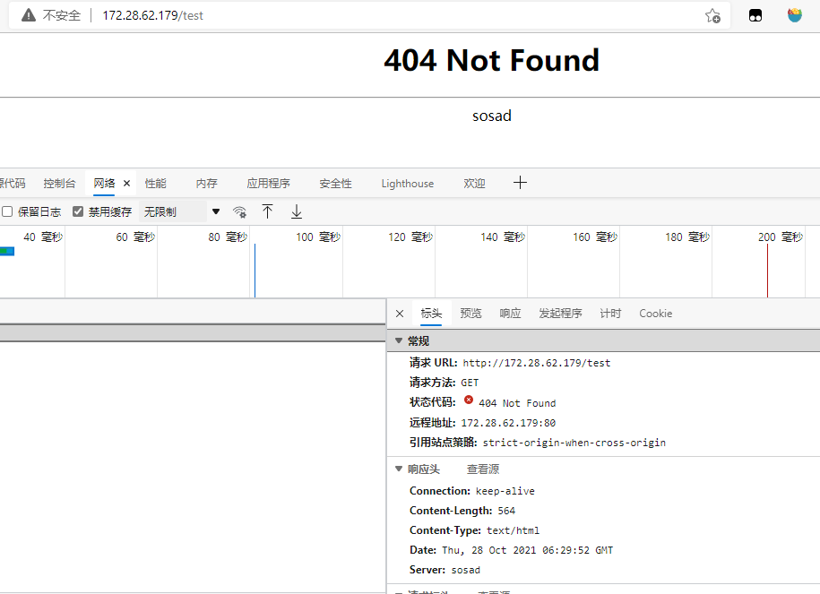

> Nginx的版本号主要在两个地方会有，一个是HTTP header，第二个地方是Nginx出错页面。对于这两个地方的版本号隐藏，Nginx都提供了简单的办法一步到位，可以通过参数或者编译前修改源码来隐藏

### 方法一：修改源码
#### 下载Nginx
```bash
#登陆nginx官网
http://nginx.org/en/download.html
#下载nginx软件包
wget http://nginx.org/download/nginx-1.14.2.tar.gz
#解压软件包
tar xvf nginx-1.14.2.tar.gz
```
#### 修改源文件
```bash
cd nginx-1.14.2/
vim src/core/nginx.h
#define NGINX_VERSION      "1.14.2"                 #修改版本号
#define NGINX_VER          "nginx/" NGINX_VERSION   #修改标识

#define NGINX_VAR          "NGINX"                  #修改标识
#define NGX_OLDPID_EXT     ".oldbin"

vim src/http/ngx_http_header_filter_module.c
static u_char ngx_http_server_string[] = "Server: nginx" CRLF;  #修改标识

vim src/http/ngx_http_special_response.c 
static u_char ngx_http_error_tail[] =
"<hr><center>nginx</center>" CRLF       #修改标识
"</body>" CRLF
"</html>" CRLF
;
```
<!-- more -->

#### 编译安装
>编译完成后 会生成中间文件 objs,若做nginx升级，只需用`objs/nginx`替换sbin/nginx文件即可
```bash
#安装编译环境
yum -y install pcre-devel gcc zlib-devel
./configure --prefix=/usr/local/nginx
#编译
make
#编译安装，只有首次安装可使用
make isntall
#启动nginx
cd /usr/local/nginx/sbin
./nginx 
```
### 效果展示


### 加参数
#### 修改配置文件
```bash
cd /usr/local/nginx
vim conf/nginx.conf
 http {
   # ...省略一些配置
   server_tokens off;
 }

cd /usr/local/nginx/sbin
./nginx -s reload
```
#### 效果展示


